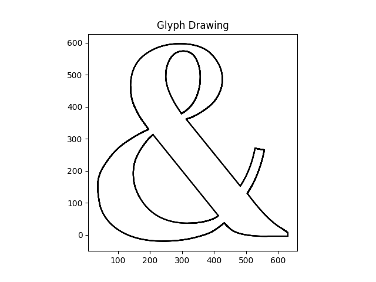
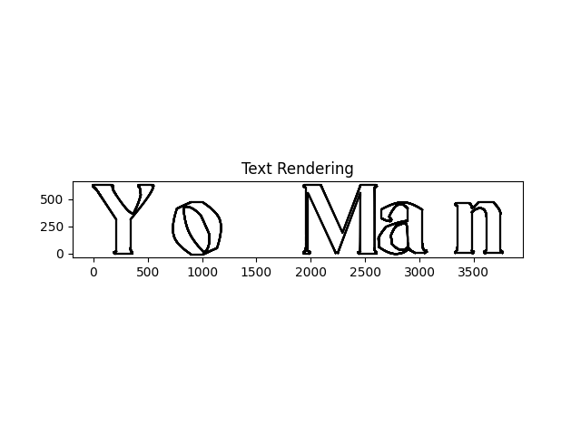

# Text Kerning

Rendering Text from glyphs

# Build & Run (renderer lib not published yet, so build manually)

Install requirements

```bash
python3 -m venv .venv
source .venv/bin/activate
pip install -r requirements.txt
```

Build renderer

```bash
cd renderer
maturin develop --release
```

Run (currently runs only parser implemented)

```bash
cd parser
python3 main.py
```

# Examples




